# 📦 Amazon Product Review Analysis

This repository contains an exploratory data analysis (EDA) of Amazon product review data. It uncovers insights about product ratings, discount strategies, pricing, and customer engagement, supporting better decision-making for product positioning and marketing.

---

## 📁 Project Structure

```bash
Amazon-Product-Review-EDA/
│
├── data/                  # Cleaned dataset (.xlsx)
├── notebooks/             # Jupyter notebook for EDA
├── outputs/
│   └── charts/            # Visualizations (Q1–Q12)
├── dashboard/             # Excel dashboard
├── reports/               # PDF summary (optional)
├── requirements.txt       # Python packages
└── README.md              # Project overview
```

---

## 🔍 Case Study Overview

- **Company**: RetailTech Insights  
- **Goal**: Analyze Amazon product & review data to provide insights that guide:
  - Product improvement
  - Discount strategy
  - Customer engagement

---

## ❓ Questions Answered (Q1–Q12)

### 🔹 Q1: Average Discount % by Category  
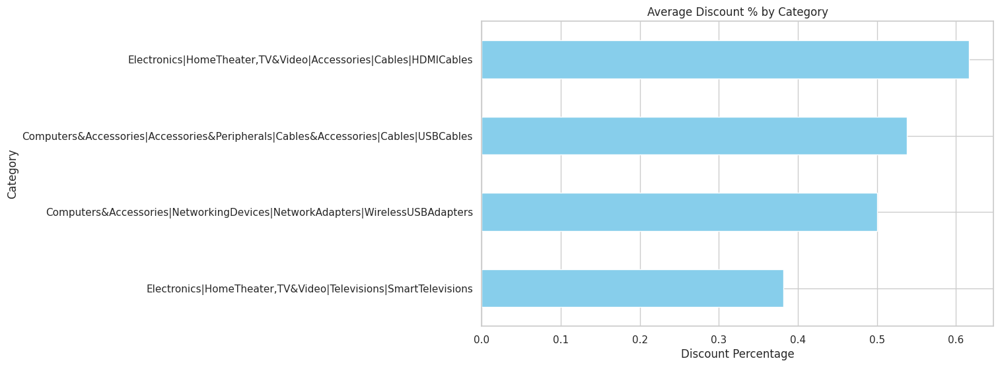

### 🔹 Q2: Number of Products per Category  
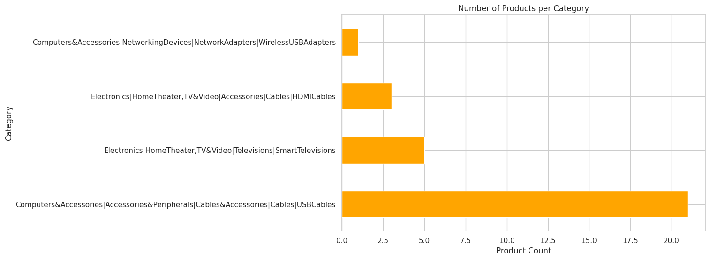

### 🔹 Q3: Total Number of Reviews per Category  
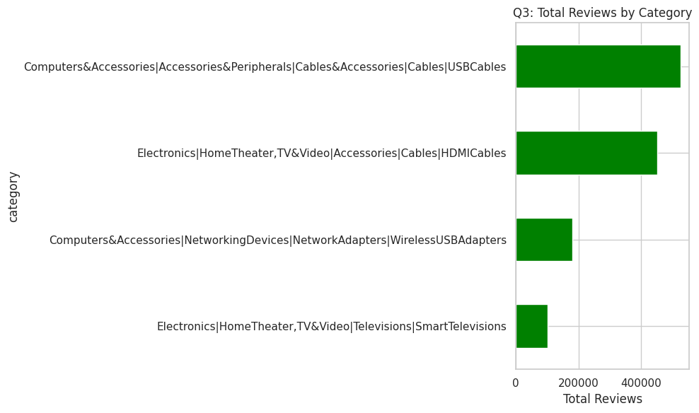

### 🔹 Q4: Top 10 Highest Rated Products  
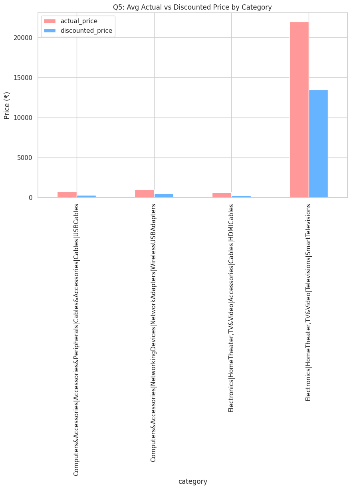

### 🔹 Q5: Average Actual vs Discounted Price by Category  
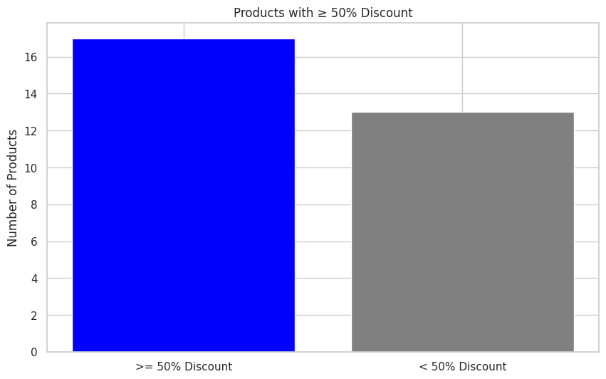

### 🔹 Q6: Top 10 Most Reviewed Products  
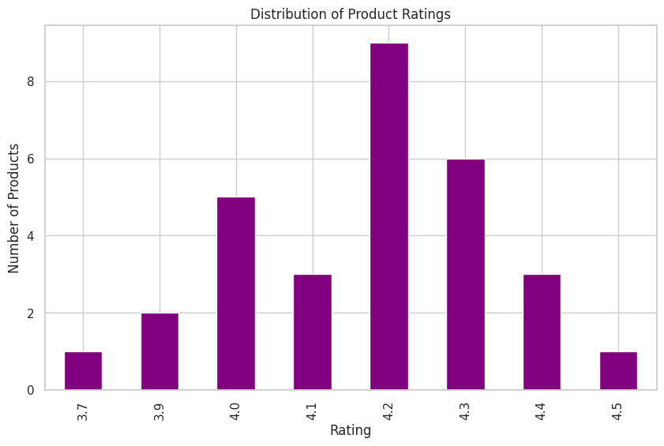

### 🔹 Q7: Products with ≥ 50% Discount  
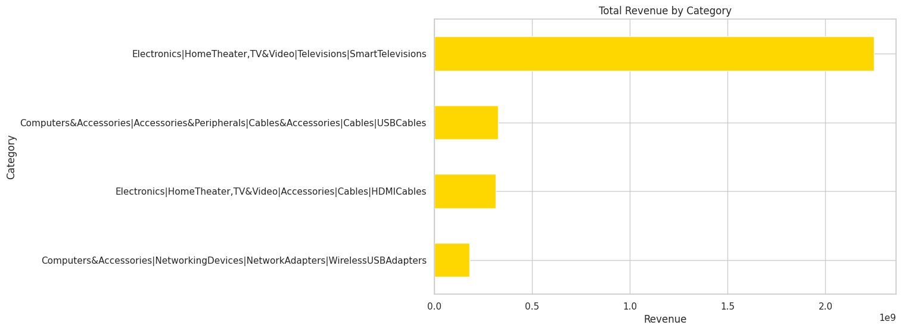

### 🔹 Q8: Distribution of Product Ratings  
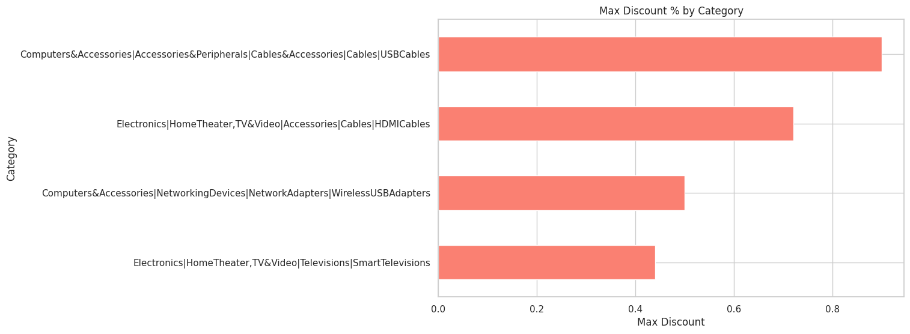

### 🔹 Q9: Total Potential Revenue by Category  
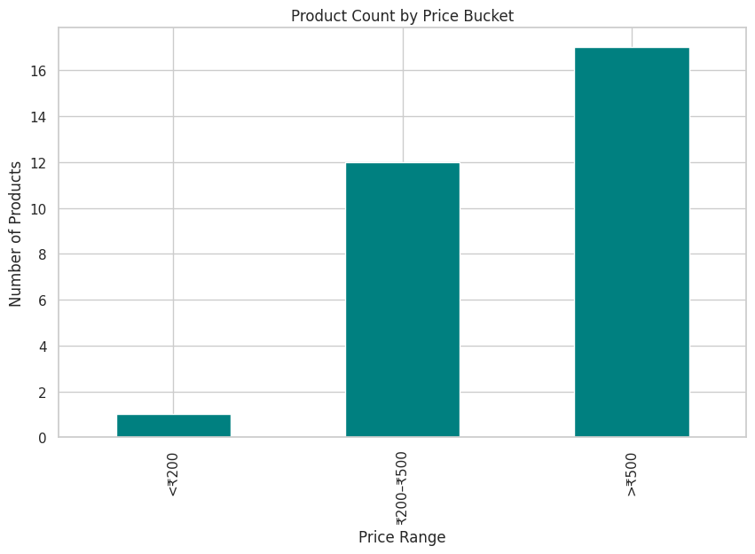

### 🔹 Q10: Products per Price Range Bucket  
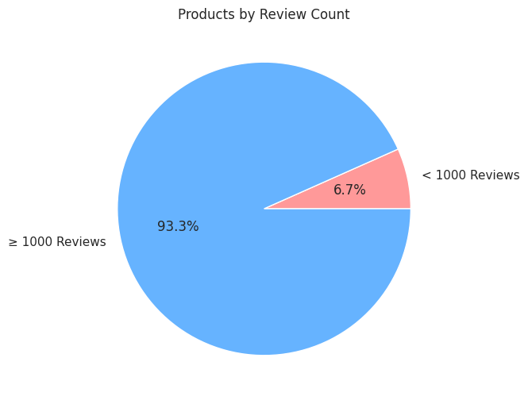

### 🔹 Q11: Correlation Between Discount % and Rating  
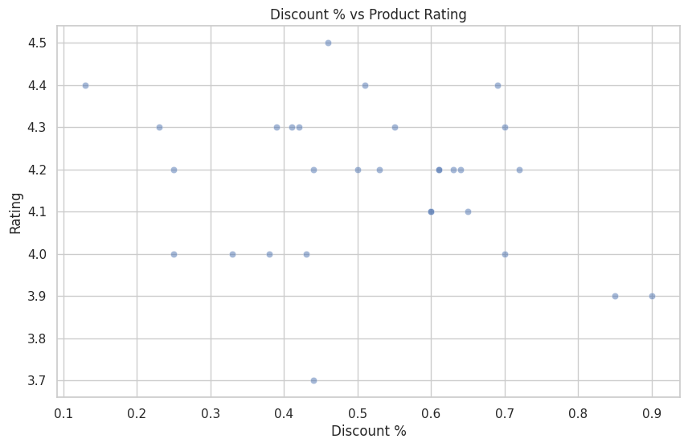

### 🔹 Q12: Number of Products with < 1,000 Reviews  
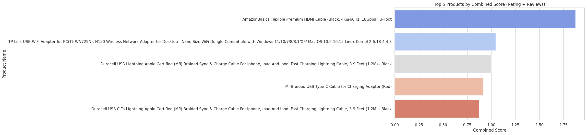

---

## 📊 Excel Dashboard

The final Excel dashboard visualizing insights and KPIs is located here:  
📁 [`dashboard/Amazon_Dashboard.xlsx`](dashboard/Amazon_Dashboard.xlsx)

---

## 🧰 Tools Used

- Python (pandas, seaborn, matplotlib)
- Excel (pivot tables, slicers, charts)
- Jupyter Notebook
- Git + GitHub

---

## 📘 License

This project is open source under the [MIT License](LICENSE).
